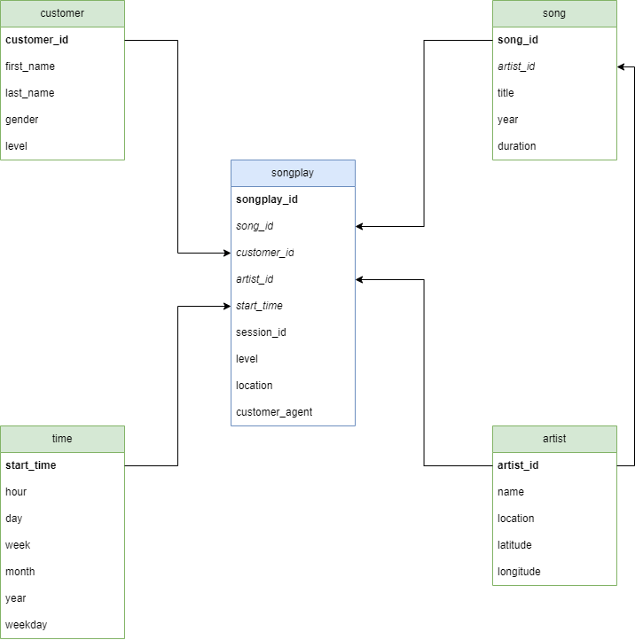

## Introduction

A startup called **Sparkify** wants to analyze the data they've been collecting on songs and user activity on their new music streaming app. The analytics team is particularly interested in understanding what songs users are listening to. They'd like to create a **Postgres database** with tables designed to optimize queries on song play analysis. In this project, I'll apply data modeling with Postgres and build an **ETL pipeline** using Python.

## Repository structure

```
📦 
├─ project-solution
│  ├─ README.md
│  ├─ create_tables.py      # database and table creation
│  ├─ data
│  │  ├─ log_data           # log dataset generated by https://github.com/Interana/eventsim
│  │  └─ song_data          # song dataset from http://millionsongdataset.com/
│  ├─ etl.ipynb             # Developing ETL pipeline
│  ├─ etl.py                # ETL pipeline
│  ├─ img                   # image folder
│  ├─ sql_queries.py        # ETL SQL queries
│  └─ test.ipynb            # Testing ETL pipeline
```
©generated by [Project Tree Generator](https://woochanleee.github.io/project-tree-generator)

## Installation

### Install PostgreSQL Server

Download the appropriate installer from https://www.postgresql.org/download/

### Create new user and database 

After postgres was installed, open the psql terminal using the default configurations (localhost, 5432 port, and so on).
Execute the following command in the console:

``` sql
CREATE DATABASE studentdb;
CREATE USER student WITH PASSWORD 'student' CREATEDB;
GRANT ALL PRIVILEGES ON DATABASE studentdb TO student;
```

Documentation about [user creation](https://www.postgresql.org/docs/8.0/sql-createuser.html). List the databases using `\du` command. List all the user with `\l` command.

### Install Python Packages

Install the `psycopg2` PostgreSQL database adapter, the `sqlalchemy` Python SQL toolkit and the `ipython-sql` SQL magic function.
> **NOTE**:  It is extremely advisable to create a seperate python environment (using [anaconda](https://www.anaconda.com/)) so that other workspaces are not going to be polluted.

```
pip install psycopg2
pip install sqlalchemy
pip install ipython-sql
```

### Execute Python Script

Open the terminal and execute the table creation script.

```
python create_tables.py
```

Populate the database with local data using ETL script.

```
python etl.py
```

## Database schema



## ETL pipeline

Description of `etl.py` scripts. Steps of ETL pipeline:

1. Connect to **sparkifydb** database

2. Process datasets using `process_data` function

    * Song dataset using `process_song_file` function: It loads the song data into dataframe. Then it selects song and artist specific data and inserts into the proper (**song** and **artist**) table.

    * Log dataset using `process_log_file` function: It loads the log data into dataframe and filters by the *NextSong* action. After converting timestamp column to datetime, time data were inserted into the **time** table. Next, customer related data were filtered and added to the **customer** table. Once all the dimension tables are populated, it inserts records into the **songplay** fact table.

3. Close the connection


## Example

Query examples are generated by the `test.ipynb` jupyter notebook.

Selecting the first five row from the **song** table:

```
%sql SELECT * FROM song LIMIT 5;
```
|            song_id |          artist_id |            title | year |  duration |
|-------------------:|-------------------:|-----------------:|-----:|----------:|
| SOMZWCG12A8C13C480 | ARD7TVE1187B99BFB1 | I Didn't Mean To |    0 |  218.9318 |
| SOCIWDW12A8C13D406 | ARMJAGH1187FB546F3 |        Soul Deep | 1969 | 148.03546 |
| SOXVLOJ12AB0189215 | ARKRRTF1187B9984DA |  Amor De Cabaret |    0 | 177.47546 |
| SONHOTT12A8C13493C | AR7G5I41187FB4CE6C |  Something Girls | 1982 | 233.40363 |
| SOFSOCN12A8C143F5D | ARXR32B1187FB57099 |   Face the Ashes | 2007 | 209.60608 |