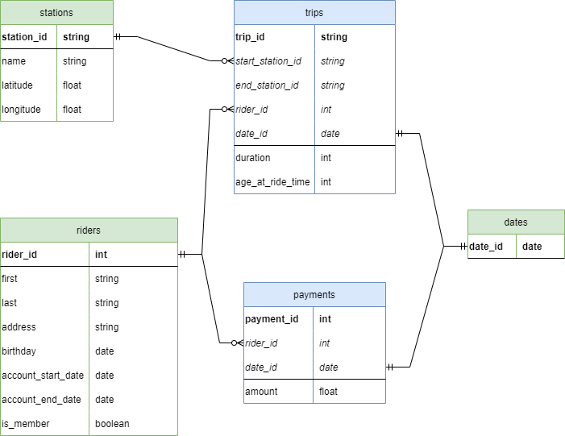

# Cloud Data Warehouses with Azure

## Create Resources

Create resource for datasets before uploading it. There are two resource which have to be created:
- PostgreSQL Flexible Server
    - Decrease the compute, storage, etc. Because the least resources are sufficient.
    - Add the computer IP address at the Firewall rules under the Networking section.
- Storage Account (Blob storage)
    - Choose the closest region, other settings stay as default.

## Upload to PostgresSQL

The `bikeshare-dataset.zip` file should be extracted using the `extract_zip.py` script to upload the data into the Azure PostgreSQL database. Once the script is executed a `data` folder is created run the following program:

```
python ProjectDataToPostgres.py
```

**Note:** Fill in the host, user, and password which is configured during resource creation in Azure. If SSL negotiation error was occured then maybe the computer IP address is changed. In order to add a new firewall rule: Go to PostgreSQL flexible Server resource then **Networking** under Settings. Next, add the computer IP address at the **Firewall rules** section.

## Azure Synapse Workspace

1. Create an Azure Synapse Workspace resource with default settings.
2. Linked the services: Manage tab -> Linked Services -> + New
    - PostgreSQL resource (fill the password if given)
    - Blob storage resource
3. Ingest data (Home tab -> Ingest button) from PostgreSQL to Blob storage. Select `public.payment`, `public.rider`, `public.station`, `public.trip` existing tables.
4. Create Managed SQL pools: Manage tab -> SQL pools -> + New
    - Decrease the performance level to the minimum

**Note**: If the SQL database does not appear under the **Workspace** tab then restart the managed SQL pool. Pause then start the SQL pool to restart it.

## ERD Diagram

Date table was generated via the most recent date from the `trip` and the `payment` table. The date generation script generates the previous year from the most recent date.



## References

* Configure external table: https://learn.microsoft.com/en-us/sql/relational-databases/polybase/polybase-configure-azure-blob-storage?view=sql-server-ver16#configure-an-external-table
* Truncate date to only hour / minute: https://stackoverflow.com/a/9783814/10721627
* Generate Dates betweeen date ranges: https://stackoverflow.com/a/7824919/10721627
* Create comprehensive date dimension: https://gist.github.com/jrgcubano/c4dbaa879a1cfc9899f961d6eafa737c
* UNION vs DISTINCT and UNION ALL performance: https://stackoverflow.com/a/35628095/10721627