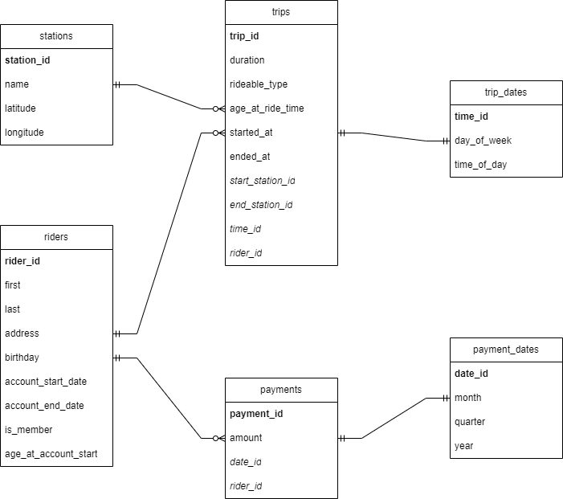

# Data Lake and Lakehouses with Spark and Azure Databricks

## Upload Bike Sharing Dataset

Once the bike sharing dataset was extracted by `extract_zip.py` script then upload the *csv* files from the databricks. Steps to be taken:
1. Login in to the databricks account
2. Select the **Data** option on the left side
3. Enable the DBFS browsing (User -> Admin Console -> Workspace settings -> Advanced -> DBFS File Browser)
4. Click on the **DBFS** tab
5. Press the **Upload** button
    - Add the target directory (optional)
    - Browse and select the extracted files

## ERD Diagram

Seperate date table dimension is created for the payment and the trip table. Because tables differ from their time granurality.

- Trip date dimension is generated hourly due to the interest of time of the day (morning, afternoon, night, evening) information.
- Payment date dimension is generated daily due to the interest of money spending per month, quarter, year.

